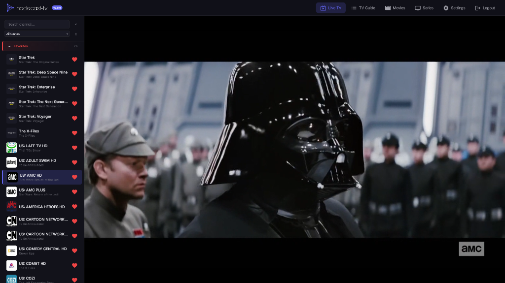
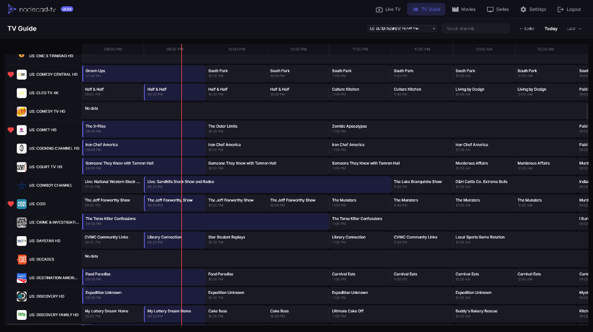
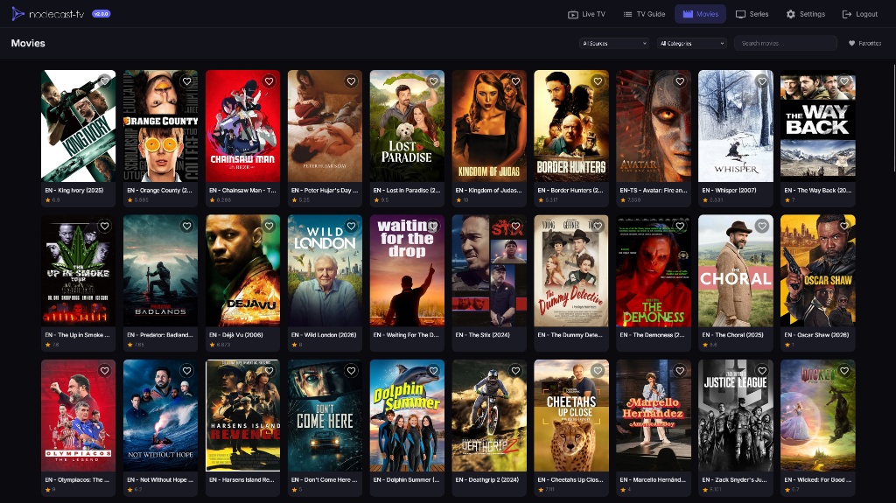
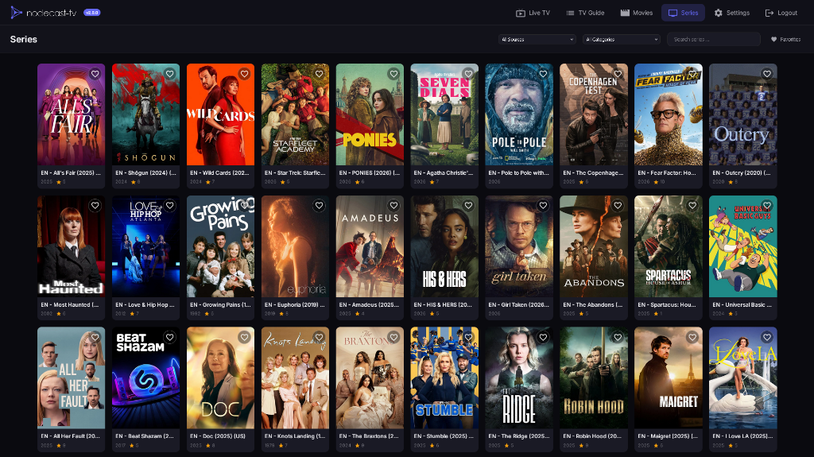

<p align="center">
  
</p>

# What is nodecast-tv?

nodecast-tv is a modern, web-based IPTV player featuring Live TV, EPG, Movies (VOD), and Series support. Built with performance and user experience in mind.

## Features

- **📺 Live TV**: Fast channel zapping, category grouping, and search.
- **📅 TV Guide (EPG)**: Interactive grid guide with 24h timeline, search, and dynamic resizing.
- **🎬 VOD Support**: Dedicated sections for Movies and TV Series with rich metadata, posters, and seasonal episode lists.
- **❤️ Favorites System**: Unified favorites for channels, movies, and series with instant synchronization.
- **🔐 Authentication**: User login system with admin and viewer roles ([details](https://github.com/technomancer702/nodecast-tv/pull/23)).
- **⚡ High Performance**: Optimized for large playlists (7000+ channels) using virtual scrolling and batch rendering.
- **⚙️ Management**: 
  - Support for Xtream Codes and M3U playlists.
  - Manage hidden content categories.
  - Playback preferences (volume memory, auto-play).
- **🎛️ Hardware Transcoding**: GPU-accelerated transcoding with NVIDIA NVENC, AMD AMF, Intel QuickSync, and VAAPI support.
- **🔊 Smart Audio**: Configurable 5.1→Stereo downmix presets (ITU, Night Mode, Cinematic) with automatic passthrough for compatible sources.
- **📦 Stream Processing**: Auto-detection of stream codecs with smart remux/transcode decisions.
- **🐳 Docker Ready**: Easy deployment containerization.

## Screenshots

<div align="center">
  
  
  
  
</div>

## Getting Started

### Prerequisites

- Node.js (v14 or higher)
- npm

### Installation

1.  Clone the repository:
    ```bash
    git clone https://github.com/yourusername/nodecast-tv.git
    cd nodecast-tv
    ```

2.  Install dependencies:
    ```bash
    npm install
    ```

3.  Start the development server:
    ```bash
    npm run dev
    ```

4.  Open your browser at `http://localhost:3000`.

### Docker Deployment

You can run nodecast-tv easily using Docker.

1.  Create a `docker-compose.yml` file (or copy the one from this repo):

    ```yaml
    services:
      nodecast-tv:
        build: https://github.com/technomancer702/nodecast-tv.git#main
        container_name: nodecast-tv
        ports:
          - "3000:3000" # Host:Container
        volumes:
          - ./data:/app/data
        restart: unless-stopped
        environment:
          - NODE_ENV=production
          - PORT=3000 # Optional: Internal container port
    ```

2.  Run the container:
    ```bash
    docker-compose up -d
    ```

The application will be available at `http://localhost:3000`.


### Hardware Acceleration Setup

To enable hardware transcoding (NVENC, QSV, VAAPI), you must expose your host's GPU to the container.

**1. Intel (QSV) & AMD (VAAPI)**
Update your `docker-compose.yml` to map the DRI devices and add necessary groups (often required for permission):
```yaml
    devices:
      - /dev/dri:/dev/dri # Required for VAAPI/QuickSync/AMF (Linux)
    # group_add:       # Optional: Needed mainly if you run as non-root
    #   - "video"      # Run on host: getent group video
    #   - "render"     # Run on host: getent group render
```

**2. NVIDIA (NVENC)**
Ensure you have the [NVIDIA Container Toolkit](https://docs.nvidia.com/datacenter/cloud-native/container-toolkit/install-guide.html) installed on your host, then update your `docker-compose.yml`:
```yaml
    deploy:
      resources:
        reservations:
          devices:
            - driver: nvidia
              count: 1
              capabilities: [gpu]
```

**Verify:**
After restarting the container, go to **Settings -> Transcoding**. The **Hardware Detection** status should list your GPU (e.g., "NVIDIA GPU Detected" or "VAAPI Available").

### Usage

1.  Go to **Settings** -> **Content Sources**.
2.  Add your IPTV provider details (Xtream Codes or M3U URL).
3.  Click "Refresh Sources".
4.  Navigate to **Live TV**, **Movies**, or **Series** to browse your content.


## Browser Codec Support & Transcoding

nodecast-tv is a web-based application. By default, **video decoding is handled by your browser**. However, the built-in **smart transcoding system** automatically converts incompatible media (e.g., HEVC video, Dolby audio) into browser-friendly formats using FFmpeg.

**Codec Compatibility Table:**

| Codec | Chrome | Firefox | Safari | Edge |
|-------|--------|---------|--------|------|
| **H.264 (AVC)** | ✅ | ✅ | ✅ | ✅ |
| **H.265 (HEVC)** | Auto-Transcode | Auto-Transcode | ✅ | ⚠️ |
| **AV1** | ✅ | ✅ | ❌ | ✅ |
| **AAC Audio** | ✅ | ✅ | ✅ | ✅ |
| **AC3/EAC3 (Dolby)** | Auto-Transcode | Auto-Transcode | ✅ | Auto-Transcode |

> **⚠️ Note:** Edge requires the [HEVC Video Extensions](https://apps.microsoft.com/store/detail/hevc-video-extensions/9NMZLZ57R3T7) from the Microsoft Store to play H.265 (HEVC) natively. If missing, Auto-Transcode will handle it.

**If a stream doesn't play:**
1.  Ensure **"Auto Transcode"** is enabled in **Settings → Transcoding**.
2.  If you have video but no audio, check that **"Force Audio Transcode"** is enabled (it should trigger automatically).
3.  If buffering persists, try switching the **Hardware Encoder** setting or reducing the **Max Transcode Resolution**.

**Note on Ad-Stitched Streams:**
For channels like Pluto TV, the player handles audio discontinuities automatically. Transcoding is rarely needed unless the base codec is incompatible.

## Supported Stream Types

nodecast-tv is optimized for **HLS (HTTP Live Streaming)**.

-   **✅ HLS (`.m3u8`)**: Fully supported and recommended. Best for adaptive bitrate and network resilience.
-   **✅ MPEG-TS (`.ts`)**: Supported via Force Remux in settings.
-   **⚠️ High Latency/P2P**: For sources like Acestream, prefer HLS output (`.m3u8`) over raw TS streams to avoid timeouts during buffering.
-   **❌ RTMP/RTSP**: Not supported natively by browsers.

## Transcoding Settings

All transcoding and stream processing settings are found in **Settings → Transcoding**.

### Hardware Encoder

| Setting | Options | Description |
|---------|---------|-------------|
| **Hardware Encoder** | Auto, NVENC, AMF, QSV, VAAPI, Software | GPU-accelerated encoding. Auto detects best available. |
| **Max Resolution** | 4K, 1080p, 720p, 480p | Limit output resolution (lower = faster). |
| **Quality Preset** | High, Medium, Low | Encoding quality/speed tradeoff. |
| **Audio Mix Preset** | Auto, ITU, Night Mode, Cinematic, Passthrough | 5.1→Stereo downmix mode (see below). |

### Audio Mix Presets

| Preset | Description |
|--------|-------------|
| **Auto (Smart)** | Copies stereo AAC as-is, uses ITU downmix for 5.1+ |
| **ITU-R BS.775** | Industry-standard balanced downmix |
| **Night Mode** | Boosted dialogue, reduced bass for quiet viewing |
| **Cinematic** | Wide soundstage, immersive surround feel |
| **Passthrough** | No processing (may cause errors on 5.1/Dolby sources) |

### Stream Processing

| Setting | What It Does | When to Enable |
|---------|--------------|----------------|
| **Auto Transcode (Smart)** | Probes streams and only transcodes/remuxes when needed | Recommended for most users (default ON) |
| **Force Audio Transcode** | Transcodes audio to AAC (video passes through) | When you have video but no audio (Dolby/AC3/EAC3) |
| **Force Video Transcode** | Full transcode of both audio and video | For HEVC/VP9 sources on unsupported browsers |
| **Force Remux** | Remuxes MPEG-TS to MP4 (no re-encoding) | For raw `.ts` streams from middleware |
| **Stream Output Format** | HLS or TS for Xtream API requests | Try TS if HLS causes buffering |

### Network

| Setting | What It Does | When to Enable |
|---------|--------------|----------------|
| **Force Backend Proxy** | Routes streams through the server for CORS headers | When streams fail with CORS errors, or using middleware |


## Troubleshooting

### Video Won't Play (Black Screen or Loading Forever)

| Symptom | Likely Cause | Solution |
|---------|--------------|----------|
| Black screen, `Access-Control-Allow-Origin` error | CORS blocked | Enable **"Force Backend Proxy"** in Settings → Transcoding |
| Black screen with `MEDIA_ERR_DECODE` | Unsupported codec (HEVC/VP9) | Ensure **"Auto Transcode"** is enabled |
| Loading forever (no error) | Browser decoder stuck | Enable **"Force Video Transcode"** (overrides Auto detection) |

### No Audio (Video Plays Fine)

| Symptom | Likely Cause | Solution |
|---------|--------------|----------|
| No audio at all | Dolby/AC3/EAC3 audio | Enable **"Force Audio Transcode"** (overrides Auto detection) |
| Audio out of sync | Stream encoding issue | Try changing stream format to TS in Settings |

### Buffering Issues

| Symptom | Likely Cause | Solution |
|---------|--------------|----------|
| Constant buffering | Slow network or weak GPU | 1. Lower **Max Resolution** (e.g. to 720p)<br>2. Try **TS** format instead of HLS |

### HTTPS / Reverse Proxy Issues

If you're running nodecast-tv behind a reverse proxy (Nginx, Caddy, Traefik) with HTTPS:

| Symptom | Likely Cause | Solution |
|---------|--------------|----------|
| Streams fail with `fragLoadError` | Mixed content (HTTPS page loading HTTP streams) | Enable **"Force Backend Proxy"** in Settings → Transcoding |
| Streams work on HTTP but not HTTPS | Reverse proxy not passing headers correctly | Ensure `X-Forwarded-Proto` header is set (see examples below) |

**Caddy example:**
```
tv.domain.com {
    reverse_proxy nodecast:3000 {
        flush_interval -1
        header_up X-Forwarded-Proto {scheme}
    }
}
```

**Nginx example:**
```nginx
location / {
    proxy_pass http://nodecast:3000;
    proxy_http_version 1.1;           # Required for chunked transfers and keep-alive
    proxy_buffering off;              # Don't buffer responses (required for streaming)
    proxy_request_buffering off;      # Don't buffer requests
    proxy_read_timeout 300s;          # VOD: 5 min timeout for large files
    proxy_connect_timeout 60s;        # VOD: Connection timeout
    client_max_body_size 0;           # No upload size limit
    proxy_set_header Host $host;
    proxy_set_header X-Real-IP $remote_addr;
    proxy_set_header X-Forwarded-For $proxy_add_x_forwarded_for;
    proxy_set_header X-Forwarded-Proto $scheme;  # Required for HTTPS detection
    proxy_set_header Connection "";   # VOD: Enable keep-alive for Range requests
}
```

### IPTV Middleware (m3u-editor, dispatcharr, Threadfin, xTeVe)
If you manage your streams with middleware tools, you may encounter CORS issues or raw MPEG-TS streams that browsers can't play directly.

**Recommended Setup:**
1.  **Force Backend Proxy:** Enable this in **Settings → Transcoding → Network**. This routes middleware streams through NodeCast TV, bypassing CORS restrictions.
2.  **Auto Transcode:** Keep this enabled (default). It will automatically detect if the middleware stream (e.g., MPEG-TS) needs to be remuxed or transcoded for the browser.

There is rarely a need to configure specific "Force Remux" settings manually anymore; the system detects stream types automatically.

### TVHeadend

If you're using TVHeadend as your source, you may need to configure a few settings for streams to play correctly in nodecast-tv:

**Option 1: Enable Force Backend Proxy (Easiest)**
- In nodecast-tv, go to **Settings → Transcoding → Network**
- Enable **"Force Backend Proxy"**
- This routes streams through the server, bypassing browser CORS restrictions

**Option 2: Configure TVHeadend CORS**
- In TVHeadend, go to **Configuration → General → Base → HTTP Server Settings**
- Add your nodecast-tv URL to **"CORS origin"** (e.g., `http://192.168.1.100:3000`)
- **Note:** You must include the protocol (`http://` or `https://`)

**Additional Tips:**
- Enable **"digest+plain"** authentication in TVHeadend if using username/password in the M3U URL
- Try different stream profiles (`?profile=pass` or `?profile=matroska`) if playback issues persist

### Acestream / P2P Streaming

If you are using `acestream-docker-home` or similar tools, you **MUST** use the HLS output format.

-   **Don't use**: `http://proxy:6878/ace/getstream?id=...` (This is a raw MPEG-TS stream)
-   **Do use**: `http://proxy:6878/ace/manifest.m3u8?id=...` (This wraps the stream in a browser-friendly HLS playlist)

## Technology Stack

- **Backend**: Node.js, Express
- **Frontend**: Vanilla JavaScript (ES6+), CSS3
- **Database**: SQLite (via better-sqlite3) for high-performance data storage
- **Streaming**: HLS.js for stream playback
- **Audio Transcoding**: FFmpeg (optional, via ffmpeg-static)

## Project Structure

```
nodecast-tv/
├── public/              # Frontend assets
│   ├── css/             # Stylesheets
│   ├── js/              # Client-side logic
│   │   ├── components/  # UI Components (ChannelList, EpgGuide, etc.)
│   │   ├── pages/       # Page Controllers (Movies, Series, etc.)
│   │   └── api.js       # API Client
│   └── index.html       # Main entry point
├── server/              # Backend server
│   ├── routes/          # API Endpoints (proxy, transcode)
│   ├── services/        # Playlist parsers, SyncService, etc.
│   ├── db/              # Database Logic
│   │   ├── index.js     # Legacy DB Wrapper
│   │   └── sqlite.js    # SQLite Connection & Schema
│   └── index.js         # Server Entry Point
└── data/                # Persistent storage (content.db, playlists)
```

## License

This project is licensed under the **GNU General Public License v3.0 (GPL-3.0)**.

You are free to:
-   **Run** the program for any purpose
-   **Study** how the program works and change it
-   **Redistribute** copies
-   **Distribute** copies of your modified versions

Under the condition that:
-   You typically must distinguish your modifications from the original work
-   You provide the source code to recipients
-   You license any derivative works under the same GPL-3.0 license

See the [LICENSE](LICENSE) file for details.
